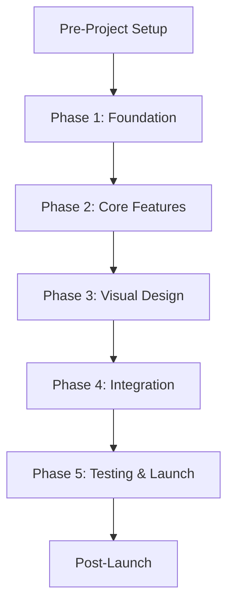

# Task Dependencies & Critical Path

## 🎯 Project Critical Path



## 📊 Detailed Task Dependencies

### Pre-Project Dependencies

```
┌─────────────────────────┐
│   Environment Setup     │
├─────────────────────────┤
│ • Node.js v18+         │ ──┐
│ • Git                  │   │
│ • VS Code + Extensions │   │
└─────────────────────────┘   │
                              │
┌─────────────────────────┐   │
│    Account Creation     │   │
├─────────────────────────┤   ├──► Can Start Project
│ • GitHub Account       │   │
│ • Vercel Account       │   │
│ • Google Cloud (Maps)  │   │
└─────────────────────────┘   │
                              │
┌─────────────────────────┐   │
│    Asset Collection     │   │
├─────────────────────────┤   │
│ • Business Info        │ ──┘
│ • Menu Data            │
│ • Images/Logo          │
└─────────────────────────┘
```

### Phase 1: Foundation Dependencies

```
START
  │
  ├─► Create SvelteKit Project
  │     │
  │     ├─► Initialize Git ──► Create GitHub Repo ──► Connect to Vercel
  │     │                                                    │
  │     └─► Create File Structure                          │
  │           │                                             │
  │           ├─► manifest.js                               │
  │           ├─► config.js ◄──────────────────────────────┤
  │           ├─► app.html                                  │
  │           └─► app.css                                   │
  │                                                         │
  └─────────────────────────────► First Deploy ◄───────────┘
```

### Phase 2: Core Features Dependencies

```
Menu System Branch:
─────────────────
menu.json ──► Menu.svelte ──► Price Formatting ──► Category Filter
    │              │                                      │
    │              └──► Error Handling                    │
    │                          │                          │
    └──────────────────────────┴──► Menu Page Complete ──┘

Location/Hours Branch:
────────────────────
Business Hours Data ──► Location.svelte ──► Hours Logic
         │                    │                 │
         │                    └──► Open/Closed Status
         │                              │
         └──────────────────────────────┴──► Contact Page

Navigation Branch:
────────────────
+layout.svelte ──► Navigation.svelte ──► Mobile Menu
       │                  │                    │
       └──► Footer ───────┴────────────────────┴──► Homepage
```

### Phase 3: Visual Design Dependencies

```
Base Styles (app.css)
         │
         ├──► Component Styling
         │         │
         │         ├──► Menu Cards
         │         ├──► Buttons
         │         └──► Forms
         │
         ├──► Animations
         │         │
         │         ├──► Scroll Reveals
         │         ├──► Hover Effects
         │         └──► Loading States
         │
         └──► Media Optimization
                   │
                   ├──► Image Compression
                   ├──► Lazy Loading
                   └──► Responsive Images
```

### Phase 4: Integration Dependencies

```
Security Templates ──┐
                    │
Environment Config ──┼──► External Integrations
                    │           │
   Menu Data ───────┘           ├──► Google Maps API
                                ├──► ORM Integration
                                └──► Phone Links
                                        │
Performance Optimization ◄──────────────┘
         │
         ├──► Timeouts
         ├──► Caching
         └──► Bundle Size
```

### Phase 5: Testing & Launch Dependencies

```
All Features Complete
         │
         ├──► Cross-Browser Testing
         ├──► Mobile Testing
         ├──► Performance Audit
         └──► SEO Validation
                   │
                   └──► Production Build ──► Deploy ──► Domain Setup
                                                           │
                                                           └──► SSL ──► LIVE
```

## 🚫 Blocking Dependencies

### Critical Blockers (Must Complete First)

| Blocker | Blocks | Resolution |
|---------|--------|------------|
| No GitHub Account | Vercel Connection | Create GitHub first |
| No Environment Variables | App Won't Start | Set in .env and Vercel |
| No Menu Data | Menu Component | Get from client |
| No Google Maps API Key | Map Integration | Create in Google Cloud |
| Missing manifest.js | Feature Verification | Create in Phase 1 |

### Non-Blocking (Can Work in Parallel)

| Task Group A | Task Group B | Notes |
|--------------|--------------|-------|
| Menu Component | Location Component | Different developers OK |
| CSS Styling | JavaScript Logic | Can progress separately |
| Desktop Design | Mobile Design | Test both continuously |
| Image Optimization | Code Development | Designer can work ahead |

## 📈 Optimal Task Sequence

### Day-by-Day Critical Path

**Day 1: Foundation**
```
Morning:
1. Environment Setup (1hr)
2. Create SvelteKit Project (30min)
3. Git + GitHub Setup (30min)

Afternoon:
4. Vercel Connection (30min)
5. File Structure (30min)
6. First Deploy Test (30min)
```

**Day 2: Configuration**
```
Morning:
1. manifest.js (30min)
2. Environment Config (45min)
3. Base CSS (45min)

Afternoon:
4. Routing Setup (30min)
5. Layout Component (45min)
6. Error Boundaries (30min)
```

**Day 3: Menu System**
```
Morning:
1. menu.json Structure (45min)
2. Add Menu Data (60min)

Afternoon:
3. Menu Component (90min)
4. Error Handling (30min)
5. Test Edge Cases (30min)
```

**Day 4: Location & Contact**
```
Morning:
1. Location Component (45min)
2. Hours Logic (60min)

Afternoon:
3. Contact Page (45min)
4. Map Integration (45min)
5. Phone Links (30min)
```

**Day 5: Homepage & Navigation**
```
Morning:
1. Hero Section (60min)
2. Navigation Component (90min)

Afternoon:
3. Mobile Menu (45min)
4. Footer (30min)
5. Integration Test (30min)
```

## 🔄 Parallel Work Opportunities

### Can Be Done Simultaneously

**Developer 1:**
- Menu System
- Homepage Components
- Performance Optimization

**Developer 2:**
- Location/Hours Logic
- Contact Page
- SEO Implementation

**Designer:**
- Image Optimization
- Icon Creation
- Loading States

## ⚠️ Risk Areas

### High Risk Dependencies

1. **Google Maps API**
   - Risk: API key delays
   - Mitigation: Use static map initially
   - Fallback: Address text only

2. **Menu Data**
   - Risk: Incomplete data from client
   - Mitigation: Create sample data
   - Fallback: "Coming Soon" sections

3. **Vercel Deployment**
   - Risk: Build failures
   - Mitigation: Test locally first
   - Fallback: Deploy to Vercel manually

4. **Mobile Responsiveness**
   - Risk: Layout breaks
   - Mitigation: Mobile-first approach
   - Fallback: Simplified mobile layout

## 📋 Dependency Checklist

### Before Starting Each Phase

**Phase 1 Checklist:**
- [ ] All software installed
- [ ] Accounts created
- [ ] PRD reviewed

**Phase 2 Checklist:**
- [ ] Project deployed to Vercel
- [ ] File structure complete
- [ ] manifest.js tracking ready

**Phase 3 Checklist:**
- [ ] All components functional
- [ ] Menu data finalized
- [ ] Base styles defined

**Phase 4 Checklist:**
- [ ] Visual design approved
- [ ] All APIs available
- [ ] Security templates ready

**Phase 5 Checklist:**
- [ ] All features complete
- [ ] Performance acceptable
- [ ] Client approval received

## 🎯 Success Path

```
Follow Dependencies → Complete Blockers First → Work in Parallel → Test Continuously → Deploy Incrementally
```

Remember: **Update manifest.js after EVERY completed task!**